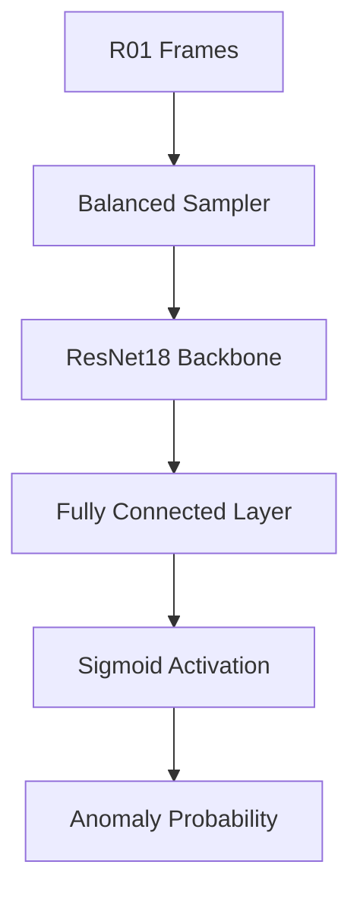

# Frame-level Anomaly Classification (R01 Optimized)

A lightweight, efficient binary image classifier using a pretrained ResNet18 model to detect frame-level anomalies in the R01 subset of the IPAD dataset.

## 🚀 System Architecture



### Key Components

- **Dataset Loader**: Balanced data loader that undersamples the dominant "Normal" class to match "Anomaly" samples.
- **Backbone**: Pretrained **ResNet18**, fine-tuned for binary classification (Normal vs Anomaly).
- **Optimization**: Binary Cross-Entropy loss with Adam optimizer.
- **Evaluation**: Comprehensive metrics including F1-score, Precision, Recall, Confusion Matrix, and ROC-AUC.

## 📊 Results Summary

The model was trained for **5 epochs** on the R01 dataset.

| Metric | Value |
| :--- | :--- |
| **Accuracy** | 0.9363 |
| **Precision** | 0.8836 |
| **Recall** | 1.0000 |
| **F1 Score** | 0.9382 |
| **ROC-AUC** | 0.9862 |

> [!TIP]
> The model achieved perfect Recall (1.00), meaning all anomaly frames in the validation set were correctly identified, though with a few false positives.

## 📁 Project Structure

- [dataset.py](file:///c:/Users/VICTUS/aipro/frame_classifier/dataset.py): Handles frame-label alignment and balanced sampling logic.
- [model.py](file:///c:/Users/VICTUS/aipro/frame_classifier/model.py): Defines the ResNet18-based classifier.
- [trainer.py](file:///c:/Users/VICTUS/aipro/frame_classifier/trainer.py): Core training and validation loops.
- [evaluator.py](file:///c:/Users/VICTUS/aipro/frame_classifier/evaluator.py): Metrics calculation and visualization routines.
- [main.py](file:///c:/Users/VICTUS/aipro/frame_classifier/main.py): Entry point for the full pipeline.

## 📈 Visualizations

````carousel

<!-- slide -->

<!-- slide -->

<!-- slide -->

<!-- slide -->

````

## 🛠️ How to Run

To re-run the training pipeline:

```bash
cd frame_classifier
python main.py --epochs 5 --batch_size 16 --output_dir results_r01
```

> [!NOTE]
> The system is fully isolated from your video anomaly detection pipeline and uses its own configuration and checkpoints.
